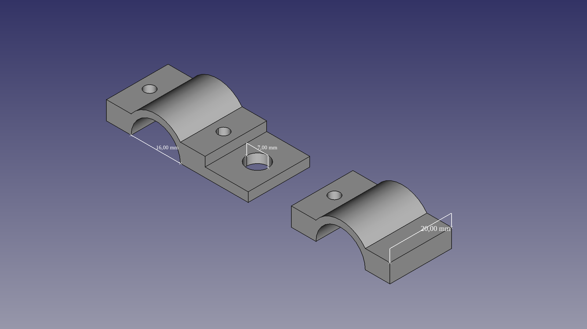

# Simple drone antenna mount
Simple drone SMA antennta mount for frame beams that are 16 mm in outer diameter. Works like a charm and fits on my frame like a glove. 
Use screws with bolts (anything from 18 mm to 20 mm should be good), since I decided not to use threaded screw holes for this part.

